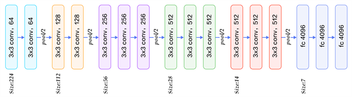

# VGG16_with_PyTorch   
Scratch implementation of VGG16 architecture using PyTorch on FashionMNIST dataset.    
   
Here is a scratch implementation of the VGG16 deep learning architecture based on the paper   
> ***"Very Deep Convolutional Networks For Large-Scale Image Recognition"*** - (K. Simonyan and A. Zisserman, ICLR 2015)    

Link to arxiv paper:- https://arxiv.org/pdf/1409.1556.pdf   
 
Kaggle notebook:- https://www.kaggle.com/code/gautamrmenon/vgg16-with-pytorch   
 
For detailed explanation regarding CNNs in general, refer to:- https://poloclub.github.io/cnn-explainer/   

</img>    

          VGG16 Architecture

